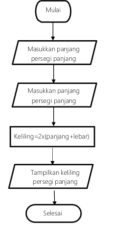

# Programming

In essence, programming is the process of giving a computer a set of instructions that it can understand and execute

# Key points for programming

## Instructions for the computer:

> Imagine you want to automate a simple task, like turning on a light when you open the door. You can program a small device to do this by writing code that tells it to

- Design/ algorithm -> sederhananya, petunjuk/ cara untuk menggunakan bahan(data) dengan sebuah cara tertentu untuk menghasilkan sesuatu(data)

- Cara menggambarkan design/ algorithm -> *flowchart*


example :

- Check if the door is open: This might involve using a sensor that detects when the door opens and closes.
- Turn on the light: This could involve sending a signal to the light bulb or a smart home system.


## Different languages, same goal

> Just like we have different languages for communication, there are many programming languages. Each language has its own syntax and rules, but they all share the same purpose: to tell the computer what to do. Popular languages include Python, Java, JavaScript, C++, and C#

### Pemrograman di komputer

1. komputer itu hanya ngerti bahasa mesin -> 1 dan 0
2. ketika manusia memerintahkan komputer untuk melakukan suatu komputasi(perhitungan), maka manusia menuliskan perintahnnya ddngan menggunakan bahasa pemrograman tingkat tinggi (bahasanya enggak langsung bisa mengerti oleh mesin)
3. dari bahasa pemrograman tingkat tinggi ke bahasa mesin, terjadi proses translate (compile)
4. contoh bahasa pemrograman tingkat tinggi -> C, C++, C#, Java, Python, PHP, Kotlin, Clojure, OCaml, Lua, Objective-C, HTML(Hyper Text Markup Language)
5. Untuk membikin aplikasi mobile -> Objective-c (iOS) dan Kotlin (Android)
    General purpose bahasa pemrograman, JAVA, C, C++
    - Aplikasi desktop (MS. Office), menggunakan C#
    - Aplikasi SMS -> Elixir
    - Aplikasi pengatur jaringan di BTS -> Ericcson (Elixir)
6. compile itu ialah merubah bahasa pemrograman tingkat tinggi ke bahasa mesin(bilangan biner -> 1 dan 0)

## More than just instructions: Programming isn't just about writing code. It also involves problem-solving, logic, and creativity. You need to be able to

- Break down complex problems into smaller steps
- Think creatively -> banyak cara untuk melakukan suatu yang menghasilkan hal sama
    example: 10 + 2 = 8 + 4

## Impact on our world: Programming is the foundation of all modern technology. From the websites you visit to the apps you use on your phone, from the video games you play to the medical devices that save lives, all of these things rely on code written by programmers

Summary:
1. Pemrograman ialah, manusia memberikan instruksi kepada komputer untuk melakukan sesuatu (perhitungan)
2. Computer hanya mengerti bahasa mesin (biner) 0 dan 1
3. O dan 1 itu terkait dengan on/off dari signal electric yang di atur dengan transistor (saklar)
4. Manusia memberikan instruksi kepada komputer dengan menggunakan bahasa tingkat tinggi, seperti HTML, Java, Python
5. Flow/ aliran dari instruksi yang diberikan manusia kepada komputer bisa disebut alogritma
6. Algoritma bisa ditulis dengan pseudecode/ atau digambarkan menggunakan flowchart


-------------------------------------------------------
Syntax -> instruksi yang sudah include dalam bahasa pemrograman, contoh, instruksi untuk menuliskan string ke screen computer

python:
```python
print("reksa")
```

javascript:
```javascript
consle.log("reksa")
```

Java:
```java
System.out.prinln("reksa");
```